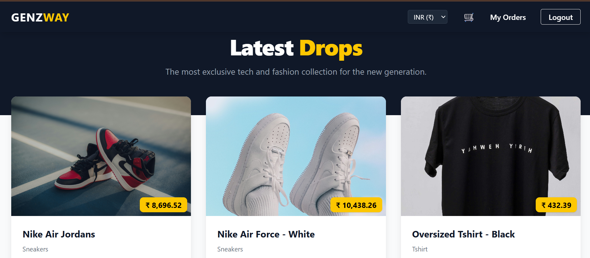

# 🛍️ GenZWay - Modern Full Stack E-commerce Platform



### 🚀 Live Demo
**Frontend (Netlify):** [https://superb-hummingbird-addb10.netlify.app](https://superb-hummingbird-addb10.netlify.app)  
**Backend API (Render):** [https://genzway-backend.onrender.com](https://genzway-backend.onrender.com)

---

## 📖 About The Project

**GenZWay** is a fully functional e-commerce platform designed for the modern generation. It features a robust RESTful API backend built with Django and a dynamic, responsive frontend crafted with React + Vite. The system supports user authentication, product management, shopping cart functionality, and secure checkout simulations.

### 🌟 Key Features
* **User Authentication:** Secure Login/Register using JWT (JSON Web Tokens).
* **Product Catalog:** Dynamic product listing with categories and details.
* **Shopping Cart:** Real-time cart management (Add, Remove, Update Quantity).
* **Checkout System:** Integrated order summary and payment simulation.
* **Admin Dashboard:** Full control over products, users, and orders via Django Admin.
* **Responsive Design:** Optimized for Mobile and Desktop views.

---

## 🛠️ Tech Stack

### **Frontend**
*  **React.js (Vite)**
*  **Modern CSS / Tailwind**
* **Axios** for API Consumption
* **React Router** for Navigation

### **Backend**
*  **Django Rest Framework (DRF)**
*  **Python 3.12**
* **JWT** for Authentication
* **CORS Headers** for Security

### **Database & Deployment**
*  **PostgreSQL (Render)**
*  **Netlify (Frontend Hosting)**
*  **Render (Backend Hosting)**

---

## ⚙️ Local Installation Guide

Follow these steps to run the project locally on your machine.

### **1. Clone the Repository**
```bash
git clone [https://github.com/SoumyarananPradhan/genzway-ecommerce.git](https://github.com/SoumyarananPradhan/genzway-ecommerce.git)
cd genzway-ecommerce
2. Backend Setup (Django)
Bash
cd backend
python -m venv venv
# Activate Virtual Environment
# Windows: venv\Scripts\activate
# Mac/Linux: source venv/bin/activate

pip install -r requirements.txt
python manage.py migrate
python manage.py runserver
The backend will run at http://127.0.0.1:8000

3. Frontend Setup (React)
Open a new terminal:

Bash
cd frontend
npm install
npm run dev
The frontend will run at http://localhost:5173

🔐 Environment Variables
To run this project, you will need to add the following environment variables to your .env file in the backend folder:

SECRET_KEY=your_secret_key DEBUG=True DATABASE_URL=your_local_database_url

🤝 Contributing
Contributions, issues, and feature requests are welcome!

Feel free to check the issues page.

📝 License
This project is MIT licensed.

Made with ❤️ by Soumyaranjan Pradhan
